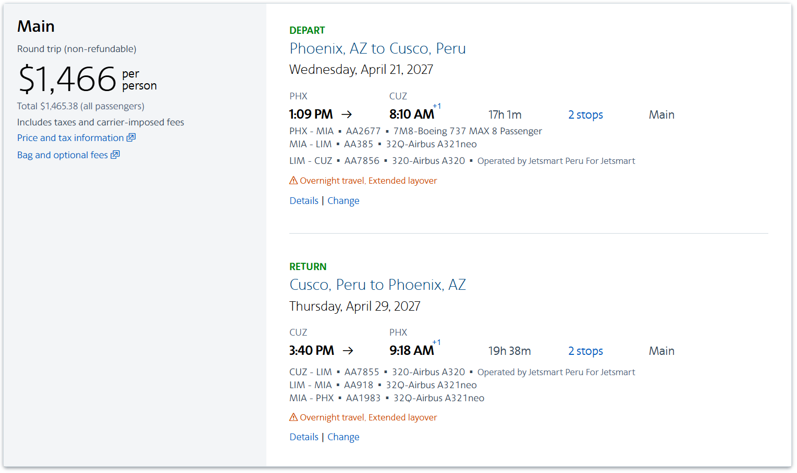

# Classic Salkantay Trek: Trip Checklist & Cost Planner

**Trip:** Classic Salkantay Trek to Machu Picchu, 5 days / 4 nights  
**Target dates:** April 24-28 or April 25-29, 2027  
**Route:** Cusco - Soraypampa - Salkantay Pass - Lucmabamba - Aguas Calientes - Machu Picchu - Cusco

Use this as a planning checklist and enter your confirmed prices in the cost table. The supplied documents do not state the actual tour price or your flight and hotel costs, so the final total is a worksheet rather than a quote.

## TL;DR

- **Trek:** 5-day Classic Salkantay, planned for Apr 24-28 or Apr 25-29, 2027; arrive in Cusco two days early to acclimatize.
- **Current Option A flight:** PHX-CUZ, Apr 21-30, shown at **$1,465.38 round trip**; two stops and overnight/extended layovers.
- **Trek budget:** **$750 estimated package price** ($400 estimated deposit + $350 balance).
- **Estimated airfare + ground costs:** **$2,470-$2,700**, before insurance, airport transfers, and optional upgrades. These are planning figures, not confirmed quotes.
- **Date caveat:** The screenshot's Apr 29 return from Cusco fits Option A only; Option B needs a return flight departing Apr 30 or later.

## Date Plan

| Option | Trek dates | Arrive in Cusco | Briefing | Return to Cusco |
|---|---|---|---|---|
| A | Sat, Apr 24-Wed, Apr 28, 2027 | Thu, Apr 22 (two days before) | Fri, Apr 23 at 5:00 p.m. | Wed, Apr 28 around 8:00 p.m. |
| B | Sun, Apr 25-Thu, Apr 29, 2027 | Fri, Apr 23 (two days before) | Sat, Apr 24 at 5:00 p.m. | Thu, Apr 29 around 8:00 p.m. |

## Recommended Flight Screenshot (Option A)

The screenshot shows **US$1,465.38 total** (displayed as about **$1,466 per person**) for a **Main** round trip. It is marked non-refundable and includes taxes and carrier-imposed fees. Both directions show overnight travel and extended layovers. This is a screenshot fare, not a booking or a guaranteed future price.

### Outbound: Phoenix to Cusco

**Wednesday, April 21, 2027** - departs PHX at **1:09 p.m.** and arrives CUZ at **8:10 a.m. Thursday, April 22** (+1 day). Total travel time is **17h 1m**, with **2 stops**.

| Segment | Flight | Aircraft / operator |
|---|---|---|
| PHX-MIA | AA2677 | Boeing 737 MAX 8 |
| MIA-LIM | AA385 | Airbus A321neo |
| LIM-CUZ | AA7856 | Airbus A320; operated by JetSmart Peru for JetSmart |

### Return: Cusco to Phoenix

**Thursday, April 29, 2027** - departs CUZ at **3:40 p.m.** and arrives PHX at **9:18 a.m. Friday, April 30** (+1 day). Total travel time is **19h 38m**, with **2 stops**.

| Segment | Flight | Aircraft / operator |
|---|---|---|
| CUZ-LIM | AA7855 | Airbus A320; operated by JetSmart Peru for JetSmart |
| LIM-MIA | AA918 | Airbus A321neo |
| MIA-PHX | AA1983 | Airbus A321neo |

This itinerary fits **Option A**: it arrives in Cusco two days before the trek and leaves the day after returning to Cusco. It does not work for Option B, which ends the trek on Apr 29; that option needs a return flight departing Apr 30 or later.

- [ ] Choose Option A or B and get the exact trek dates confirmed in writing by the operator.
- [ ] Book **two nights in a Cusco hotel before the trek**: Apr 22 and 23 for Option A, or Apr 23 and 24 for Option B. This gives you the two-day acclimatization window; the briefing is on the second evening.
- [ ] Book at least one Cusco hotel night for your return date (Apr 28 or 29). Avoid an onward flight that night; add another night if your flight schedule or connection is tight.

## Before Booking

- [ ] Arrive in Cusco **two days before the trek** and stay there through the trek departure morning to give yourself time to adjust to the elevation.
- [ ] Check passport validity: the terms require at least **6 months of validity after the travel date**.
- [ ] Send the operator your full name and passport number exactly as printed on your passport, plus sex, nationality, and date of birth.
- [ ] Request a written, itemized tour quote and written confirmation. Do not treat the booking as confirmed until Salkantay Trekking emails confirmation and verifies your payment.
- [ ] Confirm the quote is for the **5-day Classic Salkantay Trek** and ask which Machu Picchu circuit is included. Circuit 2 is requested but limited; the brochure says Circuit 3-B or 1-B may be substituted if unavailable.
- [ ] Ask the operator to confirm the deposit for the final quote. At the current **$750 estimated package price**, the supplied terms indicate a **$400 minimum deposit** and an estimated **$350 balance**, due **48 hours before the trek**.
- [ ] Review cancellation and date-change penalties before paying. The initial deposit is described as non-refundable and non-transferable; date changes cost at least **US$200 per person**, potentially more.
- [ ] Decide how to pay. Card payments add **5%** and PayPal adds **8%**; cash in US dollars or Peruvian soles avoids those stated service fees. Confirm accepted cash bills and payment location.
- [ ] If you have a medical condition, allergy, pregnancy, or are over 70, ask the operator about required medical disclosure/certificates before booking. The terms reserve the right to deny participation if requirements are not met.
- [ ] Tell the operator about dietary needs and allergies on the reservation form, and remind the guide at the briefing.
- [ ] Request any room preferences (single, double/matrimonial, or triple) and confirm whether they change the price.

## Book Travel and Lodging

- [ ] Book flights to Cusco (usually via Lima); compare baggage rules, connection times, and change/cancellation terms.
- [ ] Book **two consecutive pre-trek hotel nights** as shown in the date plan. Choose a place with vehicle access in or near the historic center for pickup.
- [ ] Confirm the trek pickup location and time with the operator the day before departure. Pickup time may shift by 30-45 minutes.
- [ ] Keep the evening before the trek free for the **5:00 p.m. briefing** at the operator's office or your hotel. Ask how to arrange another time if you cannot attend.
- [ ] Book a Cusco hotel night for **Apr 28 (Option A)** or **Apr 29 (Option B)**. The return transfer is expected around **8:00 p.m. on Day 5**, so avoid booking a same-night onward flight.
- [ ] Add a buffer night in Cusco before flying onward, especially if you have an important connection.
- [ ] Keep the first Cusco day easy: the trek company recommends resting on arrival, avoiding strenuous activity for the first two days, eating lightly, and staying hydrated while adjusting to the altitude.
- [ ] Check whether your flights and hotels can be changed if strikes, weather, landslides, or other disruptions affect the itinerary.
- [ ] Arrange travel insurance covering medical evacuation, treatment, trip interruption, and cancellation. The trek terms strongly recommend insurance; helicopter evacuation and medical treatment are the hiker's responsibility.
- [ ] Save copies of flight tickets, hotel confirmations, insurance details, passport, tour confirmation, and emergency contacts offline.

### Cusco Hotels Mentioned by Salkantay Trekking

The company's [Cusco lodging guide](https://www.salkantaytrekking.com/blog/where-to-stay-in-cusco/) recommends choosing by neighborhood as well as price. For the pre-trek nights, the **Historic Center** is a practical starting point for walkability and tour pickups; confirm the hotel can accommodate the trek vehicle at its entrance. Streets near the Plaza de Armas can be noisy at night.

| Area | What to expect | Examples named in the guide |
|---|---|---|
| Historic Center | Central and walkable, with convenient access for tour pickups; busier and potentially noisy, especially by the Plaza de Armas. | Hotel Suecia II (private rooms, breakfast); La Posada del Viajero (breakfast and guest kitchen); Tierra Viva Hoteles Cusco. |
| San Blas | Artistic, boutique atmosphere with cafes and views; some streets are steep, which may feel tiring during acclimatization. | Casa Andina Standard Cusco San Blas; Tika Wasi Casa Boutique. |
| Lucrepata | Quieter, residential feel near San Blas; a short walk downhill to the historic center and fewer restaurants nearby. | Casona La Recoleta (apartments); El Mariscal Cusco Hotel. |
| San Cristóbal | Quiet with city views and access to Sacsayhuamán; uphill from the center. | Palacio Manco Cápac; El Retablo Cusco Hotel. |

For lower-cost possibilities, the guide lists Antarki Guest House private rooms/apartments at **US$11-$15 per night** and Hospedaje Pumacurco from **S/44 per night**; these are not the same category as a standard hotel room. The planner's **$30-$50 per night** hotel estimate remains a conservative placeholder. Confirm current 2027 rates, taxes, breakfast, cancellation terms, stairs/access, and trek pickup arrangements directly before booking.

## Confirm Trek Details and Optional Costs

- [ ] Confirm Machu Picchu entry date, circuit, and entry time, plus the train schedule from Aguas Calientes to Ollantaytambo.
- [ ] Confirm how the included **one-way Consettur bus ticket** will be used. The brochure says it can be used either direction; a round-trip ticket is listed as **US$12 extra**.
- [ ] Decide whether to buy an optional Machu Picchu mountain ticket (Huayna Picchu, Machu Picchu Mountain, or Huchuy Picchu). Request the exact price and availability early; these are not included unless confirmed in writing.
- [ ] Decide whether you might take the optional train from Hidroelectrica to Aguas Calientes on Day 4. It is not included; the brochure lists **US$25 per person**, but confirm the current fare.
- [ ] Ask for the current trekking-pole rental price if you need poles. The brochure lists trekking poles at **US$25 per person**; confirm with the operator.
- [ ] Decide whether to visit Cocalmayo hot springs on Day 3. Entry and related transport are not included; ask for the current total cost if interested.
- [ ] Confirm sleeping bag rental price if you will not bring one. A sleeping bag rated around **-15°C** is recommended; rental is available, but no price is stated.
- [ ] Confirm the duffel-bag weight limit. The inclusions say **5 kg / 11 lb**, while the FAQ says **7 kg / 15.4 lb including the sleeping bag**. Get the applicable limit in writing.
- [ ] Confirm whether any entrance tickets, permits, or train bookings require additional payment beyond the written tour quote.

## Prepare for the Trek

- [ ] Break in waterproof hiking boots/shoes before travel; do not wear new shoes for the first time on the trek.
- [ ] Pack a 15-25 L daypack and waterproof cover. The operator carries a separate duffel bag between camps; verify its weight limit as above.
- [ ] Pack a warm sleeping bag rated about -15°C, or confirm rental and price.
- [ ] Pack a refillable water bottle or hydration bladder (about 2 L capacity recommended). The operator provides boiled water on the trail during specified days.
- [ ] Pack trekking poles, headlamp/flashlight, personal medications, sunscreen (SPF 70+ recommended), insect repellent, toiletries, and a small first-aid/personal-care kit.
- [ ] Pack layers for freezing nights, intense sun, rain, and warm jungle weather: thermal layers, hiking clothes, warm jacket, waterproof jacket/poncho, gloves, warm hat, sun hat, buff, and sunglasses.
- [ ] Pack hiking socks, sandals/light footwear, swimwear, and a towel if you may visit the hot springs.
- [ ] Pack snacks, camera/phone, chargers, and a power bank. Bring extra cash in Peruvian soles for meals, tips, optional services, and emergencies.
- [ ] Keep valuables and items needed during the day in your daypack; you will not have access to the duffel bag while it is being transported.
- [ ] Confirm all pickup, briefing, and emergency contact details with the operator before departure.

## Cost Worksheet

### Current Planning Estimate

**Selected scenario: US$750 Classic Salkantay package.** For one person on a budget-to-midrange plan, allow about **US$2,470-$2,700 for airfare plus trek and Cusco ground costs**, before travel insurance, airport transfers, or optional upgrades. This uses the **$1,465.38 round-trip fare shown in the supplied screenshot** plus the ground-cost estimate below. The ground estimate assumes **two economical Cusco hotel nights before the trek and one on return**, modest pre-trek meals, and some rental gear, tips, and contingency spending.

The date-specific screenshot fare is detailed in [Recommended Flight Screenshot (Option A)](#recommended-flight-screenshot-option-a); the worksheet uses it for Option A. Get a separate Apr 30-or-later return quote for Option B.

Payment fees on the $750 tour price would add about **$0 cash**, **$37.50 by card**, or **$60 by PayPal** if the fee is charged against the full tour price. That makes the estimated ground budget about **$1,005-$1,235 cash**, **$1,043-$1,273 by card**, or **$1,065-$1,295 by PayPal**. Confirm how the fee is applied to deposit and balance payments.

The screenshot shows taxes and carrier-imposed fees included. Check baggage and seat-selection fees before booking. Travel insurance and airport transfers are not included, so add confirmed quotes for a full all-in total.

### Itemized Worksheet

Enter amounts in **US dollars**. Estimates are per person unless noted. Do not count the deposit twice: it is an advance payment toward the tour price, not an extra fee.

| Item | Estimate / confirmed amount | Notes |
|---|---:|---|
| Tour package, per person | **$750 estimate** | This is the full trek's current public starting price, not the deposit; get an April 2027 written quote. |
| Minimum deposit, per person | **$400 estimate** | Supplied terms require $400 minimum for a $695-$994 package; non-refundable/non-transferable. |
| Remaining tour balance | **$350 estimate** | $750 package price minus $400 deposit; due 48 hours before start. |
| Payment fee | **$0 cash / $37.50 card / $60 PayPal** | Based on the $750 tour price and supplied 5% / 8% fees. |
| Round-trip flights, Phoenix (PHX)-Cusco (CUZ) | **$1,465.38 screenshot fare** | Screenshot itinerary is for Option A: depart PHX Apr 21, arrive CUZ Apr 22; depart CUZ Apr 29, arrive PHX Apr 30. Two stops and overnight/extended layovers; Lima-Cusco segments operated by JetSmart Peru. Recheck price, baggage fees, and connection protection before booking. |
| Cusco hotel before trek | **$60-$100 estimate** | 2 nights; based on the budget-guide range of $30-$50 per night. |
| Cusco hotel after trek | **$30-$50 estimate** | One economical night; extrapolated from the same guide's nightly range. |
| Other lodging / airport transfers | $______ | If needed. |
| Travel insurance | $______ | Get a quote; include medical evacuation and trip interruption. |
| Meals before trek | **$20-$90 estimate** | 2-3 days at about $10-$30/day. |
| Day 5 lunch and dinner | **$10-$30 estimate** | Not included in the trek; use as a modest meal allowance. |
| Machu Picchu return bus | $______ | Up to $12 extra if buying a round trip; confirm current price and included ticket use. |
| Optional mountain ticket / upgrade | $______ | Only if selected; price and availability to confirm. |
| Optional Hidroelectrica train | $______ | Listed as $25; confirm current fare. |
| Trekking-pole rental | **$25 estimate** | Listed in supplied brochure; skip if bringing your own. |
| Sleeping bag rental | **$20-$30 estimate** | Current 2026-27 budget guide range; skip if bringing your own. |
| Optional horseback rides | **$0 - not planned** | You do not plan to ride. |
| Cocalmayo hot springs | $______ | Optional; entry/transport price to confirm if you decide to go. |
| Tips | **$40-$60 estimate** | Voluntary; use as a planning allowance, not a required fee. |
| Other meals, snacks, cash, and contingency | **$50-$100 allowance** | Personal reserve; adjust to your comfort level. |
| **Ground trip estimate** | **$1,005-$1,235 cash** | Itemized estimate using the $750 package; excludes air, insurance, airport transfers, and unselected optional upgrades. |
| **Airfare + ground subtotal** | **$2,470.38-$2,700.38 cash** | Adds the $1,465.38 screenshot fare to the ground estimate; still excludes insurance, airport transfers, and unselected optional upgrades. |

### Deposit Guide

The booking terms give these minimum deposits per person based on the selected package price:

| Package price per person | Minimum deposit per person |
|---|---:|
| $1,495-$2,000 | $1,000 |
| $995-$1,494 | $500 |
| $695-$994 | $400 |
| $325-$694 | $300 |
| Up to $324 (short excursions/tours) | 100% |

At the currently listed $750 trek price, the supplied deposit table places the booking in the $695-$994 package tier, which requires a **$400 minimum deposit**. The $750 is the package price, not the deposit amount. Have the operator confirm the actual deposit and balance in writing. Card/PayPal fees may apply to both deposit and balance payments.

**Calculation:** `All-in trip total = full tour price + flights + Cusco lodging + insurance + meals + optional extras + payment fees + personal/contingency spending.` The deposit is already part of the full tour price.

## Included in the Described Tour (Verify Against Your Quote)

- 4 nights of trek accommodation: Sky Camp, Mountain Sky View, Super Jungle Domes, and an Aguas Calientes hotel.
- Meals: 5 breakfasts, 4 lunches, and 4 dinners. Day 5 lunch and dinner are excluded.
- Trek guide, campsite meals, trail water as described, daily snacks, duffel transport, and specified private transport.
- Listed entry tickets for Humantay Lake/Salkantay Trek and Machu Picchu archaeological site.
- Day 5 train from Aguas Calientes to Ollantaytambo and private transfer from Ollantaytambo to Cusco.
- One-way bus ticket between Aguas Calientes and Machu Picchu (confirm direction/use with operator).

Use the written itemized confirmation as the source of truth for what your specific booking includes.

## Questions to Resolve With the Operator

- [ ] What is the exact per-person tour price, deposit, remaining balance, and total after payment fees?
- [ ] Is the duffel allowance 5 kg or 7 kg, and does that include the sleeping bag?
- [ ] Which Machu Picchu circuit, entry time, bus direction, and train schedule are confirmed?
- [ ] What are the current prices for the optional train, bus return, mountain tickets, poles, sleeping bag, and hot springs if selected?
- [ ] What happens to the itinerary and costs if the Llactapata trail is closed, transport is disrupted, or weather/strikes change the plan?
- [ ] What are the exact cancellation-fee deadlines and calculation rules? The terms state 60% for cancellation with 42 days' notice, 80% with 14 days' notice, and 100% within 7 days; ask how the gaps between those windows are handled.

## Online Price Sources

Prices checked **September 30, 2026**. Online prices can change; confirm all amounts directly before booking. The supplied flight screenshot shows a date-specific fare for Option A; see it above.

- [Salkantay Trekking: Classic Salkantay Trek](https://www.salkantaytrekking.com/trekking-in-peru/cusco/trekking-machu-picchu-salkantay-llactapata/) - lists the 5-day trek from **US$750 per person**. This is the best match for the supplied brochure, but it is a public starting price, not a confirmed April 2027 rate.
- [Ali Peru Treks: Salkantay Trek price guide for 2026-2027](https://aliperutreks.com/salkantay-trek-price-2026-2027/) - provides independent planning ranges for Cusco lodging before the trek, daily meals, sleeping-bag rental, and optional tips. The budget above uses these line-item ranges, not its overall package total, which may reflect different inclusions and operators.
- [Salkantay Trekking: Where to stay in Cusco](https://www.salkantaytrekking.com/blog/where-to-stay-in-cusco/) - neighborhood guidance, named hotels/hostels, and a few budget accommodation examples; most recommendations do not include prices.
- [Expedia: Phoenix to Cusco flights](https://www.expedia.com/lp/flights/phx/cuz/phoenix-to-cusco) and [KAYAK: Phoenix to Cusco flights](https://www.kayak.com/flight-routes/Phoenix-Sky-Harbor-Intl-PHX/Cusco-Velasco-Astete-CUZ) - route-level comparison sources; they are not quotes for the specific screenshot itinerary.
- The deposit tiers, card/PayPal fees, optional items, and included services in this checklist come from the booking terms and trek brochure you provided.

## Trip Documents

- [Booking terms and conditions (PDF)](docs/ENG%20BOOKING%20TERMS%20AND%20CONDITIONS%20%282%29.pdf)
- [Booking terms and conditions (text)](docs/ENG%20BOOKING%20TERMS%20AND%20CONDITIONS%20%282%29.txt)
- [Classic Salkantay packing list (PDF)](docs/ENG_SKT5CL_PL.pdf)
- [Classic Salkantay packing list (text)](docs/ENG_SKT5CL_PL.txt)
- [Classic Salkantay sales brochure (PDF)](docs/ENG_SKT5CL_SALES.pdf)
- [Classic Salkantay sales brochure (text)](docs/ENG_SKT5CL_SALES.txt)
- [Recommended PHX-CUZ flight screenshot](docs/image.png)

